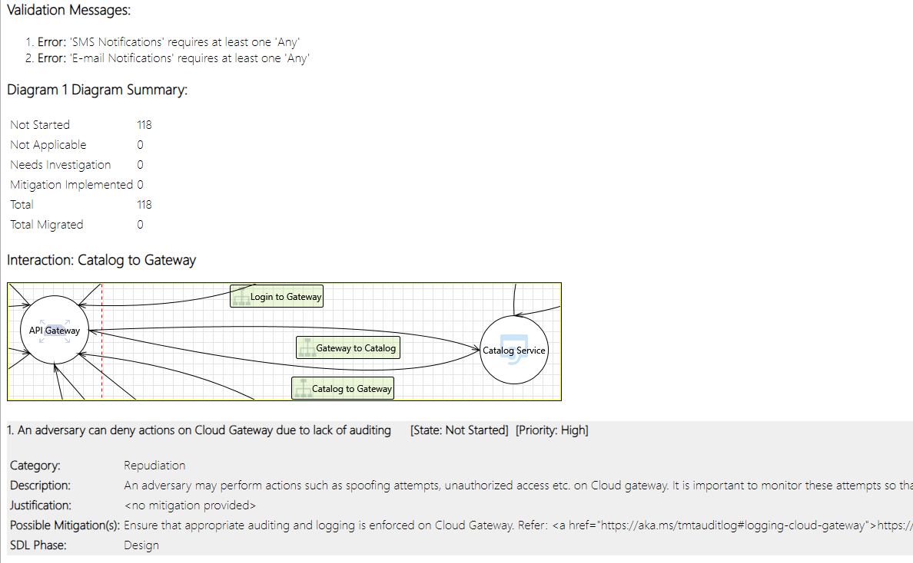
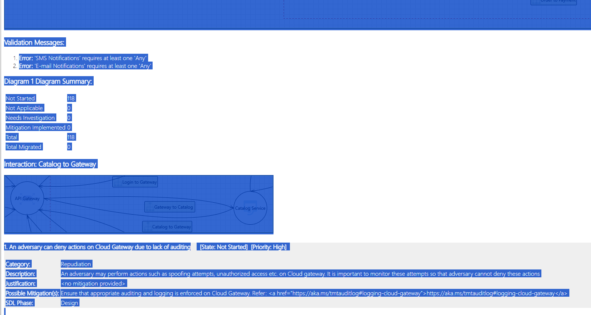
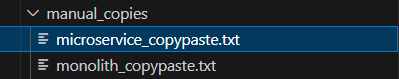

# Repository info
This repo stores code and results for my threat modeling of microservice and monolithic architecture.

Threat Modeling tools that are analyzed:
- Microsoft Threat Modeling Tool
- IriusRisk Community Edition

The analysis consists of the following:
- parsing raw report data copied from report
- serializing report data into CSV file
- analysis of:
    - number of Threats per component
    - Threats Risk Level
    - Threat type per component (eg. SQL Injection, MitM, Broken Access Control etc.)
    - Threat type relevancy for each component
    - Threat metrics exported by each Threat Modeling tools

# Results
Current results of analysis are stored in files:
- [IriusRisk microservice threat model analysis](IriusRisk/microservice/results/irius-analysis-microservice.pdf)
- [MTMT microservice threat model analysis](MTMT/microservice/results/mtmt-analysis-microservice.pdf)
- monolithic results not ready yet

# Usage (parsing MTMT raw data)

### Raw data adjustment
`raw_data` directory consists of raw data from MTMT tool that is to be adjusted for later analysis.

To successfully process raw data, do the following:
- Open each report `.htm` file in the browser

- Copy (CTRL+A in browser) all contents to the corresponding files in `manual_copies` folder


- Use `initial_mtmt_scrape.sh` script to retrieve relevant data from manual copies:
```
./initial_mtmt_scrape.sh manual_copies/monolith_copypaste.txt
./initial_mtmt_scrape.sh manual_copies/microservice_copypaste.txt
```

Processed data will look something like this:
```
Interaction: Catalog to Gateway
1. An adversary can deny actions on Cloud Gateway due to lack of auditing  [State: Not Started]  [Priority: High] 
Category:	Repudiation
Description:	An adversary may perform actions such as spoofing attempts, unauthorized access etc. on Cloud gateway. It is important to monitor these attempts so that adversary cannot deny these actions
Justification:	<no mitigation provided>
Possible Mitigation(s):	Ensure that appropriate auditing and logging is enforced on Cloud Gateway. Refer: <a href="https://aka.ms/tmtauditlog#logging-cloud-gateway">https://aka.ms/tmtauditlog#logging-cloud-gateway</a>
SDL Phase:	Design
Interaction: DB to Catalog
2. An adversary may gain unauthorized access to Web API due to poor access control checks  [State: Not Started]  [Priority: High] 
Category:	Elevation of Privileges
Description:	An adversary may gain unauthorized access to Web API due to poor access control checks
Justification:	<no mitigation provided>
Possible Mitigation(s):	Implement proper authorization mechanism in ASP.NET Web API. Refer: <a href="https://aka.ms/tmtauthz#authz-aspnet">https://aka.ms/tmtauthz#authz-aspnet</a>
SDL Phase:	Implementation
```

### Serialization of adjusted data
To Serialize data in `raw_data/initial_scrapes`, go to the `MTMT` folder and run a serialization script with the following command:
```
python3 main.py --input-file ../raw_data/initial_scrapes microservice_copypaste_initial_scrape.txt --output-path microservice/
```